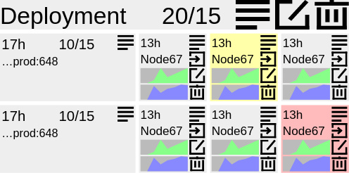

# kumap
The best dashboard for Kubernetes

Kubernetes-dashboard is painful to use and lacks funcionality. To make
kubernetes understandable for a new user it must be viewed as a guitar
pedalboard, except that it is huge and can contain thousands interconnected
entities. In this case it can be visualized as a city map, where pod is a
bulding, deployment is a street and namespace is a district.

## License
This software is distributed under the
[Apache License, v2.0](https://www.apache.org/licenses/LICENSE-2.0)